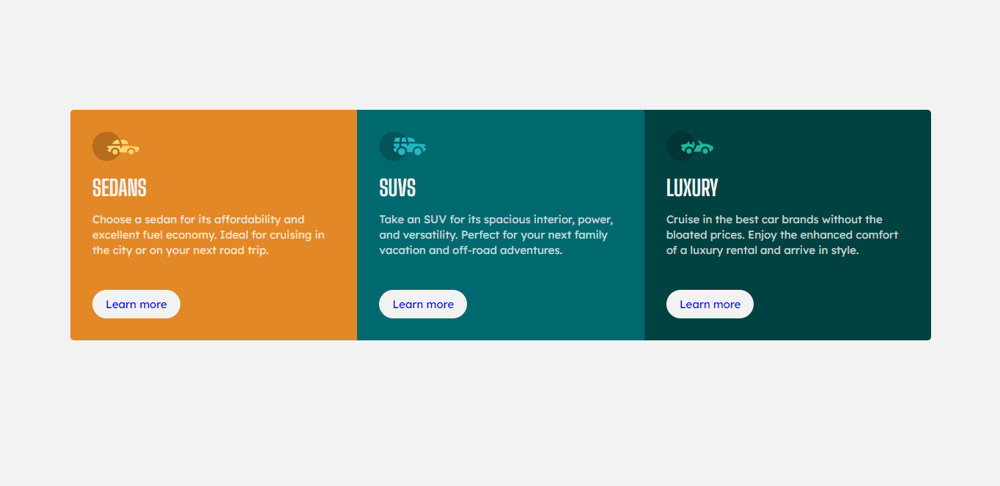

# Frontend Mentor - 3-column preview card component solution

This is a solution to the [3-column preview card component challenge on Frontend Mentor](https://www.frontendmentor.io/challenges/3column-preview-card-component-pH92eAR2-). Frontend Mentor challenges help you improve your coding skills by building realistic projects.

## Table of contents

- [Overview](#overview)
  - [The challenge](#the-challenge)
  - [Screenshot](#screenshot)
  - [Links](#links)
- [My process](#my-process)
  - [Built with](#built-with)
- [Author](#author)

## Overview

### Screenshot

### Links

- Live Site URL: [Add live site URL here](https://stalwart-druid-663fd6.netlify.app/)

## My process

### Built with

- Semantic HTML5 markup
- CSS custom properties
- CSS Grid

## Author

- Website - [Jamiu Williams AA.](https://dev-jamiu.netlify.app/)
- Frontend Mentor - [@jamiuabdulkareem](https://www.frontendmentor.io/profile/jamiuabdulkareem)
- Twitter - [@Jhayone1_2](https://www.twitter.com/jhayone1_2)
